  <!-- Banner opcional: troque a URL por um header seu (1200x400) -->
  <!--  -->

  

   

  **Desenvolvedor Full Stack** · São Caetano do Sul – SP · Híbrido/Remoto  
  React · Node.js · MySQL · APIs REST · Segurança de aplicações

   

  
  

---

### Sobre mim

Desenvolvedor Full Stack com atuação prática no desenvolvimento e manutenção de **aplicações web** e **plataformas e-commerce**, trabalhando ponta a ponta com **React**, **JavaScript**, **Node.js** e **MySQL**.

No dia a dia, construo interfaces responsivas, desenvolvo **APIs REST** com Express.js, integro sistemas ao banco de dados e evoluo produtos existentes — novas features, correção de bugs e melhorias de UX/UI em parceria com o time de design. Uso **Git** no fluxo de versionamento e metodologias ágeis (**Scrum** / **Kanban**) no ritmo de entrega.

A formação em **Cibersegurança** (USCS) reforça a visão de autenticação, controle de acesso, proteção de APIs e boas práticas de segurança no código. Atualmente cursando **pós-graduação em Engenharia de Software e Gerenciamento de Projetos** (USCS), aprofundando arquitetura, processos ágeis, PMBOK e governança de TI.

---

### Stack

  

---

### Estatísticas

<!-- Cards gerados pela GitHub Action (pasta profile/) — não dependem do vercel.app -->

  
  

 

  

---

### Contato

  
  
  

  <i>Aberto a oportunidades, colaborações e projetos desafiadores.</i>

